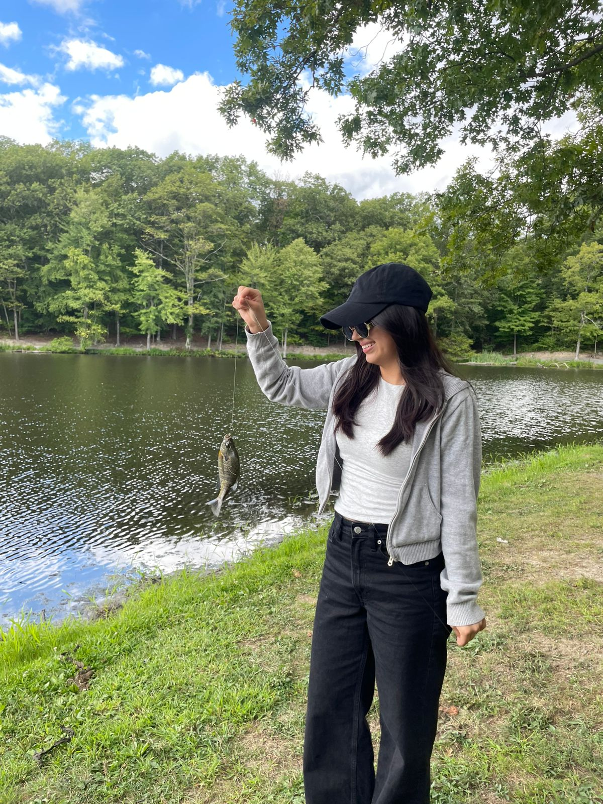
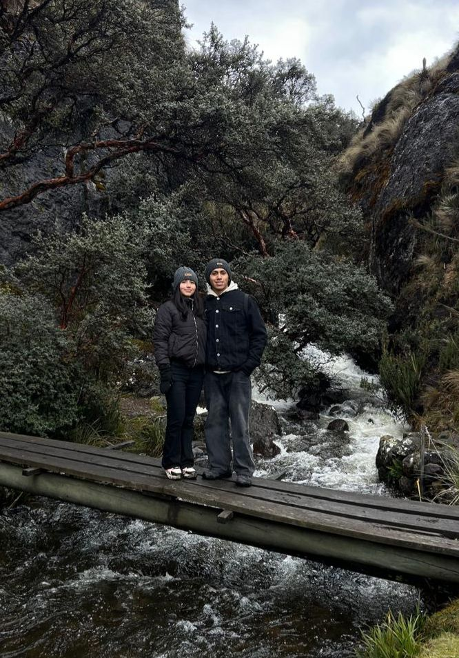

# Programación y Plataformas Web (PPW)

---

#  Práctica 1 – Explorando los Estándares Web con HTML, CSS y JavaScript
**Asignatura:** Programación y Plataformas Web  
**Unidad:** 1.2 – Estándares Web  
**Estudiante:** Diana Avila Macas
**Repositorio:**
**Página desplegada (GitHub Pages):** 

---


## 🧱 Estructura HTML utilizada
| Componente | Descripción | Implementación |
|-------------|--------------|----------------|
| `<!DOCTYPE html>` | Declaración del documento HTML5 | Línea 1 |
| `<html lang="es">` | Idioma del documento | Español |
| `<header>` | Encabezado principal | Contiene `<h1>` y `<h2>` |
| `<section>` | Agrupa contenido principal | Dos secciones con `<h2>` |
| `<table>` | Muestra los elementos estudiados | Tres filas con `<th>` y `<td>` |
| `<footer>` | Pie de página | Nombre del estudiante y asignatura |

---

## 🧩 Nuevas etiquetas exploradas
| Etiqueta | Descripción | Implementación |
|-----------|--------------|----------------|
| figure | Contenedor para imagen con pie de foto | Imagen de un Paseo con `<figcaption>` |
| aside | Muestra información complementaria y enlaces relacionados al contenido principal | Lista enumerada y enlace a mi cuenta de Instagram|

**Código usado:**
```html
<section class="card">
        <h2>Etiquetas Nuevas</h2>
        <article>
            <h4>---Ejemplos con "Figure"---</h4>
            <figure>
                
                <figcaption>Pescando</figcaption>
                
                <figcaption>Paseo</figcaption>
            </figure>
        </article>
    </section >

    <section class="card">
        <aside>
            <h4>---Datos Adicionales con "Aside"---</h4>
            <ol>
                <li>Me gusta tomar fotos de momentos especiales</li>
                <li>Me gusta conocer nuevos lugares</li>
                <li>Me gusta pasar tiempo con mis personas favoritas</li>
            </ol>

            <h4>Red Social</h4>
            <ul>
                <li><a href="https://www.instagram.com/d_avila_m?igsh=MWRyOW5ycTI3N3prMw%3D%3D&utm_source=qr">d_avila_m</a></li>
            </ul>
        </aside>
    </section>
```


---


  #  Práctica 2 – Adición de CSS y JavaScript
  ---

  ### 1. Archivos agregados

| Archivo     | Descripción                                                                                         | Ubicación                 |
| ----------- | --------------------------------------------------------------------------------------------------- | ------------------------- |
| `style.css` | Contiene todos los estilos visuales del sitio (colores, tipografía, márgenes, botones, tabla, etc.) | Carpeta raíz del proyecto |
| `script.js` | Contiene las funciones y eventos JavaScript que agregan comportamiento dinámico                     | Carpeta raíz del proyecto |

Estructura final del proyecto:

```
icc-ppw-u1-mi_pagina_web/
│
├── cajas.jpg
├── index.html
├── pescar.jpg
├── script.js
├── style.css
└── README.md
```

---

### 2. Implementación en HTML


### 3. Estilos aplicados con CSS
| Elemento                    | Estilo implementado                                            | Descripción                             |
| --------------------------- | -------------------------------------------------------------- | --------------------------------------- |
| `body`                      |         |         |
| `header`                    | |
| `table`                     |                              |                  |
| `button`                    |                                   |   |
| `section`                   |                                        |          |
| `progress`                  | `accent-color: #007bff; width: 100%;`                          | Personalización de la barra de progreso |
  
**Ejemplo en el código:**
